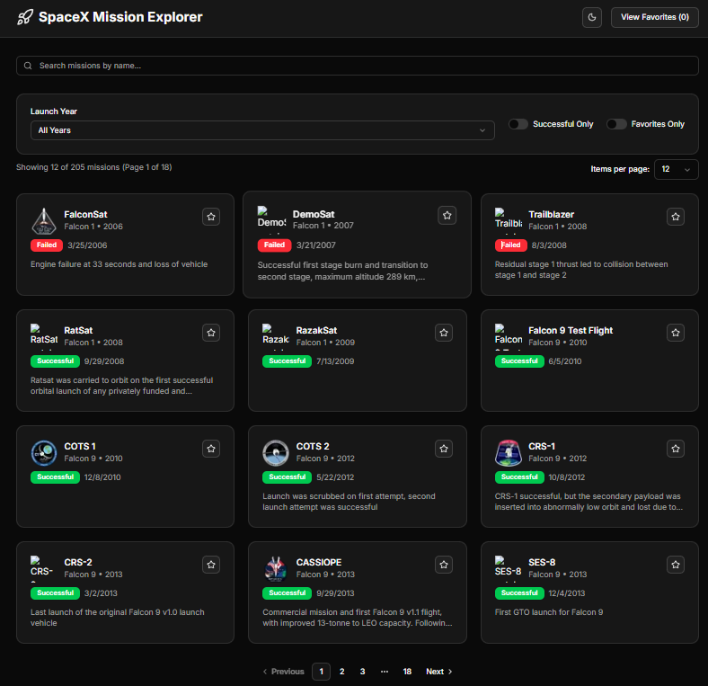

# SpaceX Mission Explorer 🚀

A modern, responsive React web application for exploring SpaceX launches and missions, built with **Next.js**, **TypeScript**, and **shadcn/ui** components.



---

## 🌟 Features

### Core Functionality
- **Browse Launches:** View all SpaceX missions with mission names, dates, rockets, and success status  
- **Advanced Search & Filtering:**
  - Debounced search by mission name  
  - Filter by launch year  
  - Toggle to show only successful launches  
  - Favorites-only view  
- **Mission Details:** Click any mission to view detailed information in a modal  
- **Favorites System:** Mark/unmark missions as favorites with persistent local storage  
- **Pagination:** Efficiently browse through large datasets with configurable items per page  

### User Experience
- **Dark/Light Theme:** Full theme customization with system preference detection  
- **Responsive Design:** Optimized for desktop, tablet, and mobile devices  
- **Loading States:** Elegant skeleton loading during data fetch  
- **Error Handling:** Graceful error states with retry functionality  
- **Accessibility:** WCAG compliant with proper ARIA labels and keyboard navigation  

### Technical Excellence
- **Performance Optimized:** Memoization, debounced search, and efficient re-renders  
- **Type Safety:** Full TypeScript implementation  
- **Modern UI:** Built with shadcn/ui components for consistent design  
- **Testing:** Comprehensive test coverage with React Testing Library  

---

## 🛠 Tech Stack
- **Framework:** Next.js 15 with App Router  
- **Language:** TypeScript  
- **Styling:** Tailwind CSS  
- **UI Components:** shadcn/ui  
- **State Management:** React Context + useState  
- **Testing:** Jest + React Testing Library  
- **Icons:** Lucide React  
- **API:** [SpaceX REST API v4](https://github.com/r-spacex/SpaceX-API)  

---

## 🚀 Quick Start

### Prerequisites
- Node.js 22  
- npm or yarn  

### Installation
```bash
git clone https://github.com/your-username/spacex-mission-explorer.git
cd spacex-mission-explorer
```
---

### Deployment
Deploy to Vercel: [https://atmosly-react-intern-assignment.vercel.app/](https://atmosly-react-intern-assignment.vercel.app/)

---

### Install dependencies:
```bash
npm install
# or
yarn install
```

### Run the development server:
```bash
npm run dev
# or
yarn dev
```

---

Open your browser and navigate to:
👉 [http://localhost:3000](http://localhost:3000)

---

### 🧪 Testing

## Run all tests:
```bash
npm test
```

## Run tests in watch mode:
```bash
npm run test:watch
```

##Generate coverage report:
```bash
npm run test:coverage
```
